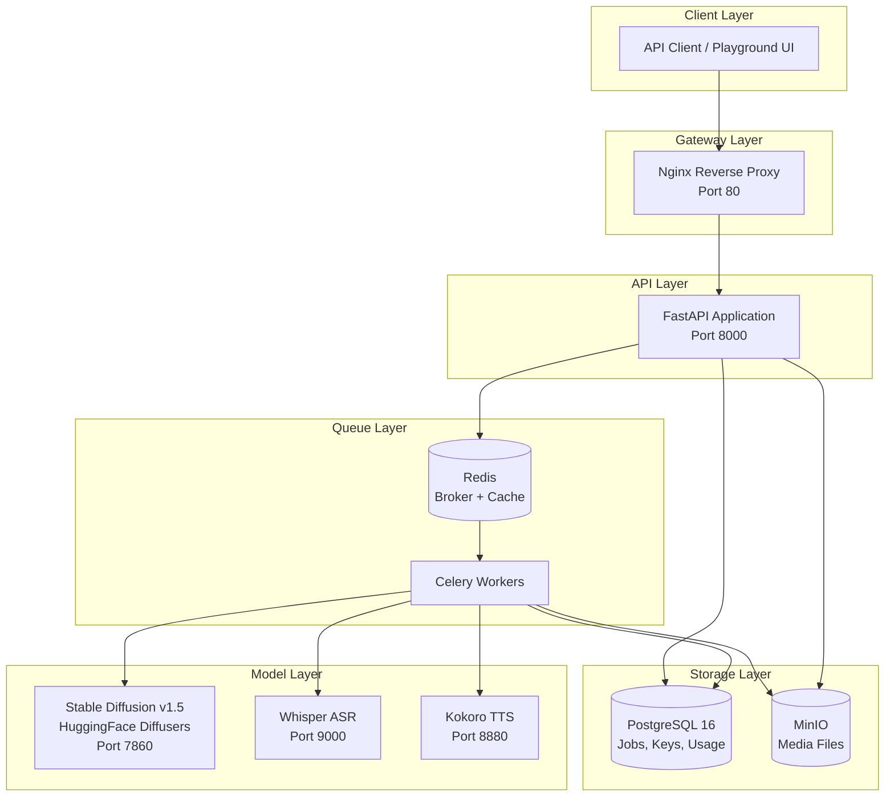

# LenAI — Production Media Inference API Platform

A unified REST API that routes image and voice inference requests to self-hosted models, with async job handling, webhook delivery, usage metering, and a developer playground.

> **One-command deployment:** `cp .env.example .env && docker compose up`

---

## Architecture



The system comprises **12 Docker containers** across 2 networks (`app_net` for services, `model_net` for model containers). The API and worker bridge both networks.

---

## Architectural Decisions

### Why PostgreSQL (not Redis/Mongo for job state)?
ACID transactions guarantee job state integrity — a job cannot be "lost" between status transitions. JSONB columns provide schema flexibility for per-modality parameters. PostgreSQL is battle-tested at scale and has excellent tooling.

### Why Celery + Redis (not just background threads)?
- **Persistence**: Redis AOF means queued jobs survive container restarts
- **Dead-letter queue**: Failed jobs are automatically tracked with full error traces
- **Separate scaling**: Model workers scale independently from the API
- **Crash recovery**: `task_acks_late=True` means a job survives worker crashes

### Why MinIO (not local filesystem)?
S3-compatible presigned URLs with TTL prevent unauthorized access. No vendor lock-in — swap to AWS S3 with a config change. Runs in Docker for self-contained deployment.


### Why YAML model registry (not hardcoded endpoints)?
Adding a new model = one YAML entry + restart. No code changes. The registry validates config at startup and provides health checking, input validation, and resource limits per model.

### RAG Design Decisions

**Why E5 embeddings (not OpenAI/Cohere)?**
Self-hosted requirement eliminates external APIs. E5-large provides strong multilingual performance at 1024 dimensions. The `query:`/`passage:` prefix convention improves retrieval quality for asymmetric search. Model can be swapped via `EMBEDDING_MODEL` env var without re-indexing — Qdrant stores raw vectors, not model-specific encodings.

**Why BM25 + dense hybrid retrieval (not semantic search alone)?**
Semantic search alone misses exact keyword matches (drug names, ICD codes, dosages). BM25 catches these. Reciprocal Rank Fusion (RRF) merges both ranked lists without requiring score calibration. The k=60 constant in RRF is the standard from the original Cormack et al. paper.

**Why this chunk size (512 tokens, 50 overlap)?**
512 tokens is the max input for most cross-encoder rerankers (ms-marco-MiniLM). Smaller chunks = more precise retrieval but risk splitting sentences. 50-token overlap preserves context at boundaries. These values are configurable via `CHUNK_SIZE` and `CHUNK_OVERLAP` env vars without code changes.

**Why cross-encoder reranking (not just bi-encoder scores)?**
Bi-encoders encode query and document independently — fast but imprecise. Cross-encoders see both together and produce much better relevance scores. We only rerank the top-K candidates (not the full corpus), so the latency cost is bounded.

**Why dual-tier LLM with confidence gating?**
Smaller models (8B) are faster and cheaper but hallucinate more on edge cases. We route high-confidence queries (where retrieval found strong matches) to the small model and low-confidence queries to the large model. Below a threshold, we refuse to answer rather than hallucinate — critical for clinical applications.

---

## Cloud Deployment (Modal + Supabase)

While the default setup runs locally via Docker Compose, LenAI is designed to be instantly deployable to the cloud using **Modal** for serverless GPU inference and **Supabase** for managed PostgreSQL and S3 Object Storage.

1. **Supabase Database & Storage:** 
   - Set up a Supabase project and get the Transaction Pooler URL.
   - Create S3 Storage credentials in Supabase. The platform will automatically provision the required `inputs` and `outputs` buckets on startup.
2. **Modal Secrets:** 
   - Save the Supabase connection string as `lenai-db-secret`.
   - Save the Supabase S3 credentials as `lenai-storage-secret`.
   - Save a Redis connection string as `redis-secret`.
3. **Deploy:** 
   ```bash
   pip install modal
   modal deploy modal_app.py
   ```

**Cloud Architecture Highlights:**
- **Persistent Celery Worker:** A lightweight CPU container (`celery_worker_modal`) stays warm 24/7 on Modal, polling your Redis queue. This maintains the robust distributed queue architecture even in the cloud.
- **Right-sized serverless workers:** Image generation and vLLM run on A10G GPU containers; Whisper and Kokoro run on CPU containers and scale down when idle.
- **RAG Volume Caching:** Embedding models are proactively downloaded into a Modal Volume during deployment, ensuring instant document ingestion.

---

## Quick Start

### Prerequisites
- Docker Engine 20.10+
- Docker Compose v2
- 16GB RAM minimum (models are memory-intensive)
- ~10GB disk for model weights (downloaded on first run)

### 1. Clone and configure
```bash
git clone <repository-url>
cd len_ai
cp .env.example .env
# Edit .env if you want to change default passwords
```

### 2. Start the stack
```bash
docker compose up -d
```

First run downloads model weights (~4-7GB) — this takes 10-30 minutes depending on internet speed. Subsequent starts use cached volumes.

### 3. Wait for health
```bash
# Check when everything is ready
curl http://localhost/readiness

# Or watch the logs
docker compose logs -f api
```

### 4. Create an API key
Open the playground at `http://localhost/playground` or via API:
```bash
curl -X POST http://localhost/v1/api-keys \
  -H "Content-Type: application/json" \
  -d '{"name": "test-key", "scopes": ["image", "voice_stt", "voice_tts"]}'
```

**Tip:** For frontend local development, you can set `VITE_API_KEY=YOUR_KEY_HERE` in your environment (e.g. `.env` file in the frontend folder) to auto-authenticate and skip the login screen.

### 5. Submit an inference request
```bash
curl -X POST http://localhost/v1/infer/image \
  -H "X-API-Key: YOUR_KEY_HERE" \
  -F "prompt=A sunset over mountains, oil painting" \
  -F "width=512" \
  -F "height=512" \
  -F "steps=20"
```

### 6. Poll for results
```bash
curl http://localhost/v1/jobs/JOB_ID_HERE \
  -H "X-API-Key: YOUR_KEY_HERE"
```

### GPU Support
```bash
docker compose -f docker-compose.yml -f docker-compose.gpu.yml up -d
```
Requires NVIDIA Container Toolkit installed on the host.

---

## API Reference

| Method | Endpoint | Description |
|--------|----------|-------------|
| `POST` | `/v1/infer/{modality}` | Submit inference job (image/voice_stt/voice_tts) |
| `GET` | `/v1/jobs/{id}` | Poll job status and result |
| `GET` | `/v1/jobs` | List jobs with pagination and filters |
| `GET` | `/v1/jobs/dead-letter` | Query dead-letter queue |
| `POST` | `/v1/api-keys` | Create API key (returns raw key once) |
| `GET` | `/v1/api-keys` | List API keys (masked) |
| `PATCH` | `/v1/api-keys/{id}` | Update key settings |
| `DELETE` | `/v1/api-keys/{id}` | Revoke API key |
| `POST` | `/v1/api-keys/{id}/rotate` | Rotate key (revoke old, issue new) |
| `GET` | `/v1/usage` | Usage dashboard with aggregates |
| `POST` | `/v1/rag/query` | Query clinical knowledge base (RAG pipeline) |
| `POST` | `/v1/rag/ingest` | Ingest document into knowledge base |
| `POST` | `/v1/rag/ingest/batch` | Batch document ingestion |
| `GET` | `/v1/rag/stats` | Knowledge base statistics |
| `DELETE` | `/v1/rag/document` | Delete document by source |
| `GET` | `/health` | Liveness probe |
| `GET` | `/readiness` | Readiness probe (checks all deps) |
| `GET` | `/docs` | Interactive OpenAPI documentation |

Full OpenAPI spec available at `http://localhost/docs`.

---

## Error Handling

Every error returns a consistent envelope:
```json
{
  "error": {
    "code": "VALIDATION_ERROR",
    "message": "File size exceeds 100MB limit",
    "details": {"max_size_mb": 100, "actual_size_mb": 142},
    "request_id": "req_abc123"
  }
}
```

- `422` — Validation errors (bad params, file type)
- `401` — Invalid or missing API key
- `403` — Key doesn't have scope for requested modality
- `429` — Rate limit exceeded (includes `Retry-After` header)
- `503` — Model container unavailable
- `500` — Internal error (stack trace logged server-side, never leaked)

---

## What Breaks First at 10x Load

**The bottleneck is model inference.** Image generation takes 30-120 seconds on CPU per image. At 10x load:

1. **Celery queue backs up** — jobs queue but don't drop. Workers process sequentially.
2. **Memory pressure** — SD model uses ~8GB RAM. Multiple concurrent requests would OOM.
3. **Presigned URL TTL** — if queue wait > URL TTL, early results expire before delivery.

**What we'd do:**
- **GPU acceleration** — 10-50x faster inference immediately
- **Horizontal worker scaling** — more Celery workers behind Redis broker
- **Model replicas** — multiple SD containers with load balancing
- **Queue prioritization** — priority queues for paid tiers
- **CDN for outputs** — offload static file serving from MinIO

---

## What Was Intentionally Cut

| Feature | Why Cut | What We'd Do |
|---------|---------|--------------|
| OAuth2/OIDC auth | API keys are simpler for this scope | Add Auth0/Keycloak integration |
| WebSocket real-time updates | Polling is more reliable for v1 | Add SSE or WebSocket for live progress |
| Row-level security | Single-tenant is sufficient here | PostgreSQL RLS policies per tenant |
| Video generation | Removed to keep the platform focused on image, voice, text, and RAG | Add a dedicated video model container |
| CI/CD pipeline | Time constraint | GitHub Actions for build/test/deploy |
| Kubernetes manifests | Docker Compose for simplicity | Helm chart with HPA for autoscaling |
| RAG retrieval evaluation | Would require curated test set | Fixed query→expected source test suite |

---

## Bootstrap / First Run

API key creation requires an existing key (multi-tenant isolation). For first-time setup:

```bash
# Seed the development database with test API keys
make seed
```

This creates two keys:
| Key | Scopes | Rate Limit |
|-----|--------|------------|
| `lenai_sk_dev_test_key_12345678` | all modalities | 120 RPM |
| `lenai_sk_limited_images_only_1` | image only | 10 RPM |

In production, you'd bootstrap the first key via a management CLI or admin endpoint.

---

## Deliverable Documents

| Document | Path |
|----------|------|
| Model Onboarding Guide | [`docs/model_onboarding.md`](docs/model_onboarding.md) |
| Load Test Report | [`docs/load_test_report.md`](docs/load_test_report.md) |
| Pricing Model | [`docs/pricing_model.md`](docs/pricing_model.md) |

---

## Development

```bash
# Setup
make setup

# Run locally (requires Docker)
make up

# View logs
make logs

# Run tests
make test

# Lint
make lint

# Seed dev data
make seed

# Health check
make health

# Stop
make down

# Clean (removes volumes)
make down-clean
```

---

## Project Structure

```
len_ai/
├── docker-compose.yml           # One-command deployment
├── docker-compose.gpu.yml       # GPU override
├── .env.example                 # All config documented
├── Makefile                     # Developer commands
├── README.md                    # This file
│
├── api/                         # FastAPI application
│   ├── Dockerfile
│   ├── entrypoint.sh            # Runs migrations, starts uvicorn
│   ├── requirements.txt
│   ├── alembic.ini
│   ├── alembic/                 # Database migrations
│   ├── model_registry.yaml      # Model config (YAML, no code changes)
│   └── app/
│       ├── main.py              # App factory, lifespan, middleware
│       ├── config.py            # Pydantic BaseSettings
│       ├── database.py          # Async SQLAlchemy
│       ├── dependencies.py      # Auth, rate limiting
│       ├── models/              # ORM models
│       ├── schemas/             # Request/response schemas
│       ├── routers/             # API endpoints
│       ├── services/            # Business logic
│       ├── workers/             # Celery tasks
│       ├── middleware/          # Error handling, logging, rate limiting
│       └── utils/               # Media, signing, logging
│
├── worker/                      # Celery worker container
├── playground/                  # Developer portal UI
├── nginx/                       # Reverse proxy
├── sd/                          # Stable Diffusion service
├── models/                      # Model download scripts
├── tests/                       # Test suite
├── scripts/                     # Utility scripts
└── docs/                        # Documentation
```

---

## License

Internal assignment — not licensed for distribution.
